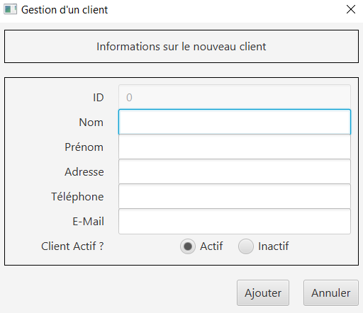
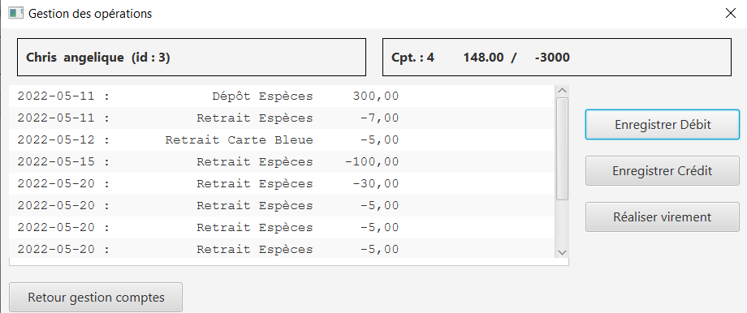

# DOCUMENTATION UTILISATEUR VERSION 0
:toc: left
:toc-title: Table des matières
:icons: font
:nofooter:

## Présentation générale

### Contexte 

Pour s’adapter aux exigences d’instantanéité de leurs clients, les banques françaises ont accentué leurs efforts de restructuration et leurs investissements dans le digital. Des chantiers longs et coûteux. Elles ne se contentent pas de créer des offres alternatives : elles rénovent aussi en profondeur leurs services de banque au quotidien. +
Le réseaux de bancaire Dailybank possèdent plusieurs outils qui deviennent obsolètes et une première version d’application qui nécessite une refonte. Les besoins de la banque ont évolués, tout comme ceux de leurs clients, il faut donc développer plusieurs fonctionnalités pour répondre à ces nouveaux besoins.

### Objectifs de l'application

L’objectif recherché par la banque DailyBank est de développer une application Java-Oracle de gestion de comptes, pour remplacer plusieurs outils obsolètes.
Pour ce faire, une première version est mise à dispotion "DailyBank" qu’il faudra adapter aux nouveaux besoins.
Ces nouveaux besoins sont :

* Elle doit permettre de gérer des comptes bancaires de dépôt pour des clients créés

* Elle doit permettre de débiter et de créditer un compte de deux manières différentes :

** Par échange d’argent entre deux comptes distincts domiciliés dans le même réseau bancaire

** Par personne physique se présentant devant un guichet

## Installation de l'application

Pour pouvoir lancer l'application, l'installation de Java en version 1.8 est nécessaire.
Pour ce faire, vous devez  suivre ces étapes : 

* Télécharger gratuitement la version 1.8 de Java sur le https://www.java.com/fr/download/[site d'Oracle]
** Vous pouvez au préalable vérifiez que l'installation c'est bien réaliser (depuis un terminal) :

    $ java -version 

Ensuite lancer le fichier .jar depuis un terminal (si il ne s'ouvre par en double cliquant dessus) :

(depuis un terminal) :

    $ cd '.\Desktop\DailyBank workspace\'
    $ java -jar Dailybank.jar

## Utilisation de l'application

Deux utilisateurs distincts peuvent être constaté, ils sont le guichetier et le chef d'agence. En plus des fonctionnalités qu'ont les guichetier qui sont :

* débiter un compte (java et BD avec procédure stockée)

* Créer un compte

* Effectuer un virement de compte à compte

* Clôturer un compte

les chef d'agence peuvent :

Gérer (faire le « CRUD ») les employés (guichetier et chef d’agence)

## Fonctionnement de l'application

### Utilisateur : Guichetier

#### Fenêtre principale

*quitter l'application*

TIP: Un bouton « quitter » est accessible depuis l'onglet « utilisateur » 

En cliquant sur ce bouton, l'utilisateur quittera l'application

image:img/quitter-appli.png[]

NOTE: Une alerte de validation s'ouvrira

image:img/alerte-quitter.png[]

*Connexion à un compte*

TIP: Un bouton « connexion »  est accessible depuis l'onglet « utilisateur » 

En cliquant sur le bouton « connexion » l'utilisateur pourra se connecter à son compte.
Ce bouton ouvre une fenêtre de connexion demandant les information de l'utilisateur :

* Login (le nom / identifiant de l'utilisateur)

* Mot de passe

image:img/connection.png[]

WARNING: Si l'une de ces deux informations est fausse ou bien les deux, un message d'erreur sera affiché à l'écran.

image:img/erreur-connection.png[]

*Deconnexion d'un compte*

TIP: Un bouton « deconnexion »  est accessible depuis l'onglet « utilisateur » 

En cliquant sur le bouton « deconnexion » l'utilisateur pourra se déconnecter de son compte.

image:img/deconnection.png[]

*Gestion des clients*

NOTE: Cette fonctionnalités n'est accessible que si l'utilisateur est connectée
      Cette fonctionnalités est accessible depuis l'onglet « gestion »

image:img/gestion-client.png[]

En cliquant sur le bouton « client » l'utilisateur pourra gérer les clients de l'agence bancaire en ouvrant une fenêtre de gestion des clients.

image:img/gestion-client2.png[]

#### Fenêtre gestion des clients

*Recherche d'un client*

En cliquant sur le bouton « rechercher » l'utilisateur pour rechercher un client de l'agence bancaire.
Les résultats seront visible sur la ListView et peuvent être affinés en entrant les informations :

* Numéro (numéro du client)

* Nom

* Prénom

image:img/recherche-client.png[]

*Création d'un nouveau client*

En cliquant sur le bouton « nouveau client » l'utilisateur pourra créer un nouveau client en ouvrant une nouvelle fenêtre de création d'un client et en entrant les informations :

* Nom 
* Prénom
* Adresse
* Téléphone
* E-mail
* Cliant actif

image:img/nouveau-client.png[]

WARNING: Si l'une de ces informations n'est pas entrée une alerte s'affiche présentant l'erreur

Cliquer sur le bouton « Ajouter » aura pour action de créer le nouveau client et de l'ajouter à la Base de Donnée et cliquer sur le bouton « annuler » aura pour action d'annuler la création du client. 

image:img/nouveau-client-erreur.png[]

*Modification d'un client*

TIP: Un client doit être sélectionner pour effectuer cette action

image:img/modification-client.png[]

En cliquant sur le bouton « modifier client » une fenêtre s'ouvrira dans laquelle l'utilisateur pour modifier les informations de celui-ci :

Cliquer sur le bouton « modifier » aura pour action de modifier les informations du client et de les enregistrer dans la Base de Donnée et cliquer sur le bouton « annuler » aura pour action d'annuler la modification du client. 

* Nom
* Prénom
* Adresse
* Téléphone
* E-mail
* Client-actif

image:img/modification-client2.png[]

WARNING: Si l'une de ces informations n'est pas entrée une alerte s'affiche présentant l'erreur

image:img/modification-client-erreur.png[]

*Gestion des comptes d'un client*

TIP: Un client doit être sélectionner pour effectuer cette action

En cliquant sur le bouton « comptes client » une fenêtre s'ouvrira dans laquelle l'utilisateur pour consulter les comptes d'un client.

image:img/gestion-compte.png[]

image:img/gestion-compte2.png[]

#### Fenêtre gestion des comptes 

*voir les opération d'un comptes*

TIP: Cette fonctionnalité est accessible en sélectionnant un compte

image:img/gestion-operation.png[]

En cliquant sur le bouton « voir opérations » un fenêtre s'ouvrira dans laquelle l'utilisateur pourra consulter les opérations du comptes d'un client.

## Résultats et production de l'application