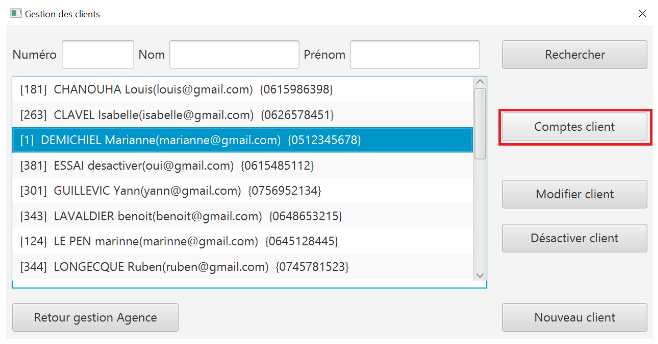

# DOCUMENTATION TECHNIQUE VERSION 1
:toc: left
:toc-title: Table des matières
:icons: font
:nofooter:

## Présentation générale

### Use Case global

L'utilisation de l'application DailyBank se fait par deux utilisateurs distincts : 

*Les guichetiers* : Ils possèdent les droits leur permettant de gérer les clients de l'Agence bancaire ainsi que leur comptes. +
Ainsi ils peuvent :

* gérer les clients de l'Agence bancaire :
** Ajouter de nouveaux clients 
** Modifier les informations des clients déjà présent 
* gérer les comptes des clients de l'Agence bancaire :
** 

*Les Chefs d'Agence* : Ils possèdent les mêmes droits que les guichetiers et gèrent en plus les employés. +
Ainsi ils peuvent : 

* gérer le CRUD des employés

### Structuration en packages

#### Architecture de la V1

#### Arborescence des packages

* Application : +
Continent les fichiers en .java qui permettent de lancer l'application.

* Application.control : +
Contient les contrôleurs de dialogue permettant l'accès aux données de l'application. En d'autres termes, il contient tous les fichiers .java permettant de représenter toutes les fenêtres de l'application.

* Application.view : +
Continent toutes les vues de l'application, c'est à dire tous les classes .fxml ainsi que les controlleurs associés. En d'autres termes, il contient tous les classes permettant l'interaction avec l'application (gestion des vues et contrôles des saisies)

* Application.tools : +
Contient tous les classes utilisé pour le package view et le package control.

* Model.data : +
Contient les classes permettant d'intéragir avec la Base de Données puisque les classes de ce package représente les tables de la Base de Données.

* Model.orm : +
Continent toutes les classes qui permettent d'effectuer des requêtes SQL dans la Base de Données. 

* Model.exception : +
Contient toutes les classes qui gère les différentes exception de l'application. +

### Fonctionnalités de l'application

##### Création d'un nouveau client : Fonctionnalité de la version existante

Cette fonctionnalité répond à l'Use-Case : *Créer un nouveau client* +
Elle permet de créer un nouveau client dans l'Agence bancaire. +
Lorsque l'utilisateur clique sur le bouton « nouveau client », le contrôleur de vue clientsmanagementcontroller transfère les informations nécessaire au contrôle clientsmanagement pour l'affichage de la fenêtre de création d'un client. +
La fenêtre de création des clients s'ouvre et la classe clienteditorpane est utilisée et permet de transmettre les informations au contrôleur de vue clientseditorpanecontroller. + 
Ainsi les saisies de l'utilisateurs sont contrôlers et peuvent s'enregistrer dans la Base de Données si elles sont valides grâce à la classe AccessClients.

##### Modification d'un client : Fonctionnalité de la version existante

Cette fonctionnalité répond à l'Use-Case : *modifier info client* +
Elle permet de modifier les informations d'un client dans l'Agence bancaire. +
Lorsque l'utilisateur clique sur le bouton « modifier client », le contrôleur de vue clientsmanagementcontroller transfère les informations nécessaire au contrôle clientsmanagement pour l'affichage de la fenêtre de modification d'un client. +
La fenêtre de modification des clients s'ouvre et la classe clienteditorpane est utilisée et permet de transmettre les informations au contrôleur de vue clientseditorpanecontroller. + 
Ainsi les saisies de l'utilisateurs sont contrôlers et peuvent s'enregistrer dans la Base de Données si elles sont valides grâce à la classe AccessClients.

##### Consultation des clients : Fonctionnalité de la version existante

Elle permet de consulter la liste des clients de l'Agence bancaire. +
Lorsque l'utilisateur clique sur le bouton « rechercher », le contrôleur de vue clientmanagementcontroller transfère les informations nécessaire à l'affichage de la liste des clients à la classe AccessClients. 

##### Consulter les comptes d'un client : Fonctionnalité de la version existante

Cette fonctionnalité permet de consulter la liste des comptes d'un client de l'Agence. +
Lorsque l'utilisateur clique sur le bouton « comptes client », le contrôleur de vue comptesmanagementcontroller transfère les information nécessaire au contrôle comptesmanagement pour l'affichage de la fenêtre de gestion des comptes. +
La fenêtre de gestion des comptes s'ouvre et grâce au transfère des informations nécessaire à l'affichage de la liste des comptes à la classe AccessCompte.

##### Consulter les opérations des comptes des clients : Fonctionnalité de la version existante

Cette fonctionnalité permet de consulter la liste des opérations du compte d'un client. +
Lorsque le client clique sur le bouton « voir opérations », le contrôleur de vue comptesmanagementcontroller transfère les informations nécessaire au contrôle operation operationmanagement pour l'affichage de la fenêtre de gestion des opération. +
La fenêtre de gestion des opérations s'ouvre grâce au transfère des informations nécessaire à l'affichage de la liste des opérations grâce à la classe AccessOperation.

##### Clôturer et réactiver un compte : réalisé par Ruben

Cette fonctionnalité permet de clôturer ou bien de réactiver le compte d'un client. 

image:img/cloture-compte1.png[]

Elle concerne le Use-Case : *Cloturer un compte*
et concerne ce diagramme de classe : 

image:img/diagramme-cloture-compte.png[]

La fonction “Clôturer/Reéactiver un compte” est une nouvelle fonctionnalité qui apparaît dans la v1. Celle-ci se développe aux travers de 2 classes : AccessCompteCourant et ComptesManagementController. 
D’abord dans AccessCompteCourant, on va créer 2 nouvelles méthodes afin de pouvoir utiliser une requête SQL afin de mettre à jour les comptes pour d’une part soit les clôturer et donc mettre leurs soldes à 0 ainsi que les rendre inactifs.

image:img/code-cloture-compte1.png[]

Soit les réactiver en leur mettant par défaut un solde de 10 euros et un découvert de -200.

image:img/code-cloture-compte2.png[]

Enfin dans ComptesManagementController, on crée une méthode qui va servir tant pour clôturer le compte que pour le réactiver et on va adapter la méthode validateComponentState() qui va rendre accessible certains boutons de la fenêtre selon si le compte est clôturé où non dans la base de données. 

image:img/code-cloture-compte3.png[]

Dans la méthode doCloturerCompte() qui a alors une double fonction, la différenciation de quel action à effectuer se fait en partie grâce au label affiché par le bouton concerné. En effet dans validateComponentState(), selon si le compte est clôturé ou non, celui-ci change le label du bouton concerné afin de marquer la différence d’état (si il est clôturé celui-ci “demandera” pour le réactiver et inversement). Et donc selon ce qui est écrit cela va lancer une partie différente de la méthode.
Voici la partie concerné pour clôturer le compte : 

image:img/code-cloture-compte4.png[]

Et celle pour réactiver le compte :

image:img/code-cloture-compte5.png[]

Ici j’utilise une boîte de dialogue pour mettre en action la fonctionnalité pour s’assurer que c’est bien une action volontaire de la part de l’employé.

##### Virement d'un compte à un autre : réaliser par Yann

Cette fonctionnalité permet de réaliser un virement d'un compte vers un autre.

image:img/technique-virement2.png[]
image:img/technique-virement3.png[]

Elle concerne le Use-Case *effectuer un virement compte à compte* et concerne le diagramme de classe : 

Lorsque cette fonctionnalité a été codée, l’un des points importants était de récupérer la liste complète des comptes existant dans la BD.
Dans la classe “AccessCompteCourant” du package model.orm, j’ai donc rajouté la méthode sans paramètre “getListeCompteCourant” qui retourne une liste (ArrayList) de tous les comptes existants.

La partie la plus importante de la fonctionnalité se trouve dans la classe “OperationsManagement” du package application.control dans la méthode “enregistrerVirement()”.
Ci-dessous un extrait du code de cette méthode dans laquelle on parcours notre liste de compte et :
Si l’entier saisi (correspondant au numéro de compte à créditer) est égal à un numéro de compte existant alors on applique; - le débit sur le compte concerné; - le crédit sur le compte correspondant au numéro saisi.
Sinon on affiche une boîte de dialogue.

##### Gérer le CRUD des employés : Réaliser par Christopher

Cette fonctionnalité répond à l'Use-Case : *Gérer le CRUD des employé*

image:img/usecase-crud.png[]

Elle concerne le diagramme de classe :

image:img/diagramme-crud.png[]

* *d'afficher la liste des employés*

Affiche la liste des employé présent dans l'Agence bancaire et stockée dans la Base Données. +
En cliquant sur le bouton « rechercher » les informations des employés s'affiche sur la fenêtre. Le contrôleur de vue employemanagementcontroller transfère les informations au contrôleur employemanagement qui se connecte à la Base de Données en utilisant la classe AccessEmploye.

image:img/rechercher-crud.png[]

* *modifier les informations d'un employé*

Modifie les informations d'un employé de l'Agence bancaire stockée dans la Base de Données. 

image:img/modifier-crud.png[]

image:img/modifier-crud2.png[]

En cliquant sur le bouton « modifier employé » le contrôleur de vue employemanagementcontroller transfère les informations nécessaire au contrôleur Employemanagement pour afficher la page de modification des employé grace au contrôleur de vue employeeditorpane. +
Si les saisies de l'utilisateur sont correct, la modification de l'employé s'effectue dans la Base de Données grâce à la classe AccessEmploye.

image:img/code-modifier-crud.png[]
image:img/code-modifier-crud2.png[]

* *de désactiver un employé*

* *de créer un nouvel employé*

Créer un nouvel employé dans l'Agence bancaire, stockée dans la Base de Données.

image:img/nouveau-employe.png[]
image:img/nouveau-employe2.png[]

En cliquant sur le bouton « nouveau employé » le contrôleur de vue employemanagementcontroller transfère les informations nécessaire au contrôleur Employemanagement pour afficher la page de cration des employé grace au contrôleur de vue employeeditorpane. +
Si les saisies de l'utilisateur sont correct, la cration de l'employé s'effectue dans la Base de Données grâce à la classe AccessEmploye.

image:img/code-new-employe.png[]
image:img/code-new-employe2.png[]