# DOCUMENTATION UTILISATEUR VERSION 1
:toc: left
:toc-title: Table des matières
:icons: font
:nofooter:

## Présentation générale

### Contexte 

Pour s’adapter aux exigences d’instantanéité de leurs clients, les banques françaises ont accentué leurs efforts de restructuration et leurs investissements dans le digital. Des chantiers longs et coûteux. Elles ne se contentent pas de créer des offres alternatives : elles rénovent aussi en profondeur leurs services de banque au quotidien. +
Le réseaux de bancaire Dailybank possèdent plusieurs outils qui deviennent obsolètes et une première version d’application qui nécessite une refonte. Les besoins de la banque ont évolués, tout comme ceux de leurs clients, il faut donc développer plusieurs fonctionnalités pour répondre à ces nouveaux besoins.

### Objectifs de l'application

L’objectif recherché par la banque DailyBank est de développer une application Java-Oracle de gestion de comptes, pour remplacer plusieurs outils obsolètes.
Pour ce faire, une première version est mise à dispotion "DailyBank" qu’il faudra adapter aux nouveaux besoins.
Ces nouveaux besoins sont :

* Elle doit permettre de gérer des comptes bancaires de dépôt pour des clients créés

* Elle doit permettre de débiter et de créditer un compte de deux manières différentes :

** Par échange d’argent entre deux comptes distincts domiciliés dans le même réseau bancaire

** Par personne physique se présentant devant un guichet

## Installation de l'application

Pour pouvoir lancer l'application, l'installation de Java en version 1.8 est nécessaire.
Pour ce faire, vous devez  suivre ces étapes : 

* Télécharger gratuitement la version 1.8 de Java sur le https://www.java.com/fr/download/[site d'Oracle]
** Vous pouvez au préalable vérifiez que l'installation c'est bien réaliser (depuis un terminal) :

    $ java -version 

Ensuite lancer le fichier .jar depuis un terminal (si il ne s'ouvre par en double cliquant dessus) :

(depuis un terminal) :

    $ cd '.\Desktop\DailyBank workspace\'
    $ java -jar Dailybank.jar

## Utilisation de l'application

Deux utilisateurs distincts peuvent être constaté, ils sont le guichetier et le chef d'agence. +
En plus des fonctionnalités qu'ont *les guichetier qui sont :*

* Consulter les comptes d'un client

** Voir les opération d'un compte

*** Enregistrer un débit 
*** Enregistrer un crédit
*** Réaliser un virement de compte à compte  

** Modifier les informations d'un compte
** Clôturer/Réouvrir un compte
** Créer un nouveau client

* Modifier les information d'un client

* Désactiver/Réactiver un client

* Créer un nouveau client

*les chef d'agence peuvent :*

* modifier les informations d'un employé 

* Désactiver un employé

* Créer un nouvel employé

## Fonctionnement de l'application

### Utilisateur : Tous les utilisateurs

#### Fenêtre principale

*quitter l'application*

TIP: Un bouton « quitter » est accessible depuis l'onglet « utilisateur » 

En cliquant sur le bouton « quitter » une fenêtre de confirmation s'affiche. +
Au clique du bouton « ok » si une connexion à un compte est établie, celle-ci est arreté et la fenêtre de l'application se ferme. +
Au clique du bouton « annuler » l'application continue de fonctionner et la fenêtre de confirmation se ferme.

image:img/img2/quitter-appli.png[]

image:img/img2/alerte-quitter.png[]

*Connexion à un compte*

TIP: Un bouton « connexion »  est accessible depuis l'onglet « utilisateur » 

En cliquant sur le bouton « connexion » l'utilisateur pourra se connecter à son compte.
Ce bouton ouvre une fenêtre de connexion demandant les information de l'utilisateur :

* Login (le nom / identifiant de l'utilisateur)

* Mot de passe

image:img/img2/connection.png[]

WARNING: Si l'une de ces deux informations est fausse ou bien les deux, un message d'erreur sera affiché à l'écran.

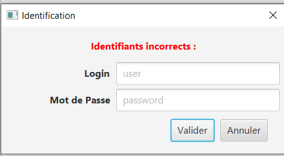

*Deconnexion d'un compte*

TIP: Un bouton « deconnexion »  est accessible depuis l'onglet « utilisateur » 

En cliquant sur le bouton « deconnexion » l'utilisateur pourra se déconnecter de son compte.

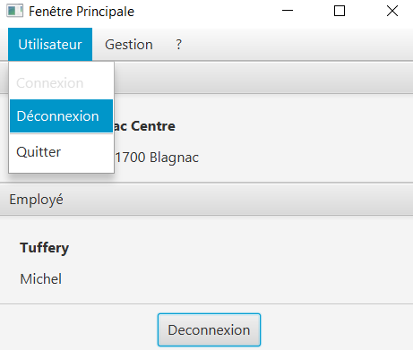

*Gestion des clients*

NOTE: Cette fonctionnalités n'est accessible que si l'utilisateur est connectée
      Cette fonctionnalités est accessible depuis l'onglet « gestion »

image:img/img2/gestion-client.png[]

En cliquant sur le bouton « client » l'utilisateur pourra gérer les clients de l'agence bancaire en ouvrant une fenêtre de gestion des clients.

image:img/img2/gestion-client2.png[]

### Utilisateur : Guichetier

NOTE: Ces fonctionnalités sont aussi disponible pour les comptes ayant les droits d'accès Chef d'Agence.

#### Fenêtre gestion clients 

*Recherche d'un client*

En cliquant sur le bouton « rechercher » l'utilisateur pour rechercher un client de l'agence bancaire.
Les résultats seront visible sur la ListView et peuvent être affinés en entrant les informations :

* Numéro (numéro du client)

* Nom

* Prénom

image:img/img2/recherche-client.png[]

*Gestion des comptes d'un client*

TIP: Un client doit être sélectionner pour effectuer cette action

En cliquant sur le bouton « comptes client » une fenêtre s'ouvrira dans laquelle l'utilisateur pour consulter les comptes d'un client.

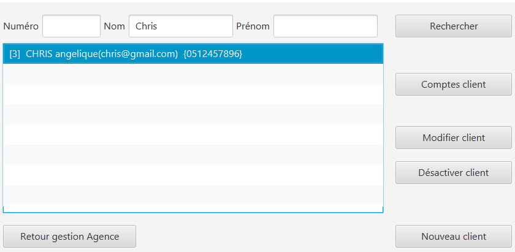

image:img/img2/gestion-compte2.png[]

*Modification d'un client*

TIP: Un client doit être sélectionner pour effectuer cette action

image:img/img2/modification-client.png[]

En cliquant sur le bouton « modifier client » une fenêtre s'ouvrira dans laquelle l'utilisateur pour modifier les informations de celui-ci :

Cliquer sur le bouton « modifier » aura pour action de modifier les informations du client et de les enregistrer dans la Base de Donnée et cliquer sur le bouton « annuler » aura pour action d'annuler la modification du client. 

* Nom
* Prénom
* Adresse
* Téléphone
* E-mail
* Client-actif

image:img/img2/modification-client2.png[]

WARNING: Si l'une de ces informations n'est pas entrée une alerte s'affiche présentant l'erreur

image:img/img2/modification-client-erreur.png[]

*Désactivation d'un client*

Cette fonctionnalité permet de désactiver le compte du client sélectionner. +
En cliquant sur le bouton « désactiver client », l'utilisateur fait passer l'etat du client sélectionner à "inactif".

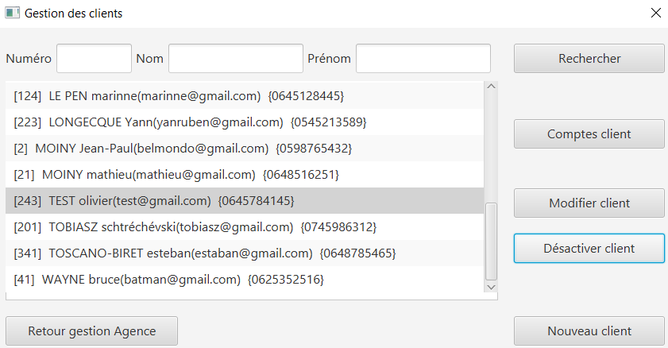

NOTE: Une alerte de confirmation s'affiche à l'écran

image:img/alert-desac-client.png[]

*Réactivation d'un client*

*Création d'un nouveau client*

En cliquant sur le bouton « nouveau client » l'utilisateur pourra créer un nouveau client en ouvrant une nouvelle fenêtre de création d'un client et en entrant les informations :

* Nom 
* Prénom
* Adresse
* Téléphone
* E-mail
* Cliant actif

image:img/img2/nouveau-client.png[]
image:img/img2/nouveau-client2.png[]

WARNING: Si l'une de ces informations n'est pas entrée une alerte s'affiche présentant l'erreur

Cliquer sur le bouton « Ajouter » aura pour action de créer le nouveau client et de l'ajouter à la Base de Donnée et cliquer sur le bouton « annuler » aura pour action d'annuler la création du client. 

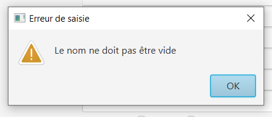

#### Fenêtre gestion des comptes 

*gestion des opération d'un comptes*

TIP: Cette fonctionnalité est accessible en sélectionnant un compte

image:img/img2/gestion-operation.png[]

En cliquant sur le bouton « voir opérations » un fenêtre s'ouvrira dans laquelle l'utilisateur pourra consulter les opérations du comptes d'un client.

image:img/img2/gestion-operation2.png[]

*modification d'un compte*

Cette fonctionnalité permet de modifier les informations du client sélectionner. +
En cliquant sur le bouton « modifier client », une fenêtre de modification des client s'ouvrira.

image:img/modif-client.png[]

image:img/modif-client2.png[]

WARNING: si les informations saisies ne sont pas correct, une alerte s'affiche

image:img/erreur-modif-client.png[]

*clôturation d'un compte*

Cette fonctionnalité permet de clôturer le compte d'un client. +
En cliquant sur le bouton « clôturer compte », une fenêtre de confirmation s'ouvrira et si l'utilisateur clique sur le bouton «  oui », l'etat du compte passe en inactif (cloturer).

image:img/cloturer-compte.png[]

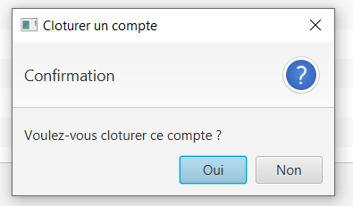

image:img/cloturer-compte3.png[]

*réactivation d'un compte*

*création d'un nouveau compte*

Cette fonctionnalité permet de crée un nouveau compte pour le client. +
En cliquant sur le bouton « nouveau compte », une fenêtre de création d'un nouveau compte s'ouvre

image:img/nouveau-compte.png[]

En cliquant sur le bouton « ajouter », le nouveau compte s'ajoutera à la Base de Données, et en cliquant sur le bouton « annuler », l'action s'annulera.

image:img/nouveau-compte2.png[]

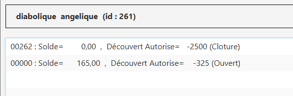

#### Fenêtre gestion des opérations

*enregistrer un débit*

Cette fonctionnalité permet d'enregistrer un débit sur le compte d'un client. +
En cliquant sur le bouton « enregistrer débit », une fenêtre d'enregistrement de débit s'ouvrira

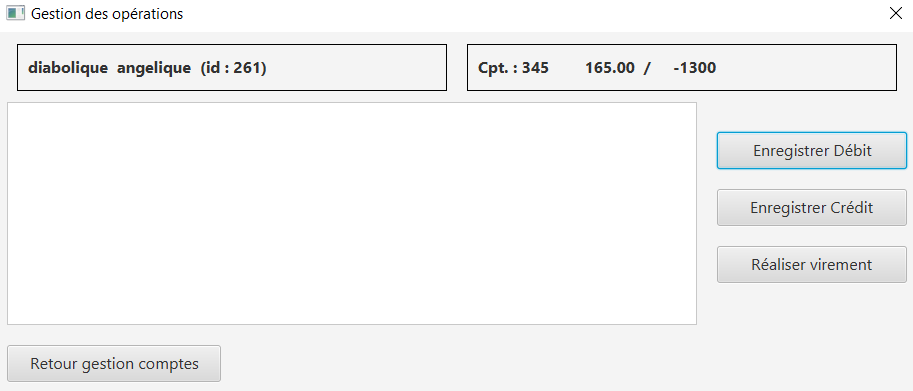
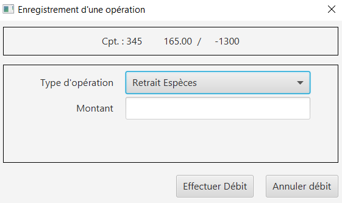

En cliquant sur le bouton « effectuer débit », cela aura pour effet de retirer le montant du débit sur le compte dans la Base de Données, et en cliquant sur le bouton « annuler débit » cela annulera l'action.

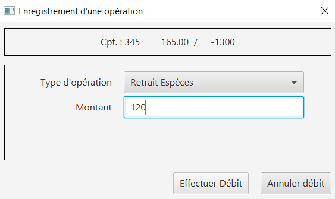
image:img/enregistrer-debit4.png[]

WARNING: Le montant à débiter ne peut pas dépasser le découvert autorisé du compte

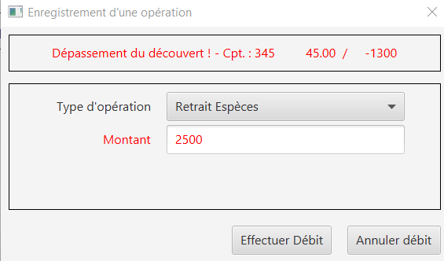

NOTE: le type d'opération peut être "espèces" ou carte bancaire

image:img/enregistrer-debit6.png[]

*enregistrer un crédit*

Cette fonctionnalité permet d'enregistrer un crédit sur le compte d'un client +
En cliquant sur le bouton « enregistrer crédit » une fenêtre d'enregistrement de crédit s'ouvrira

image:img/credit.png[]

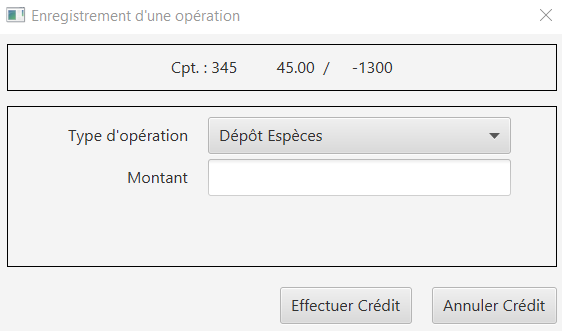

En cliquant sur le bouton « effectuer crédit », cela aura pour effet d'ajouter le montant du crédit sur le compte dans la Base de Données et en cliquant sur le bouton « annuler crédit » cela annulera l'action

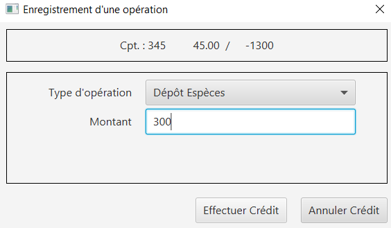

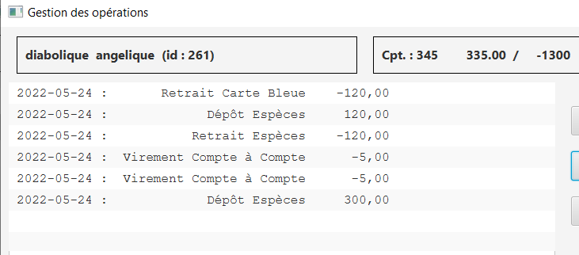

WARNING: si le montant est trop élevé, une exception est levé

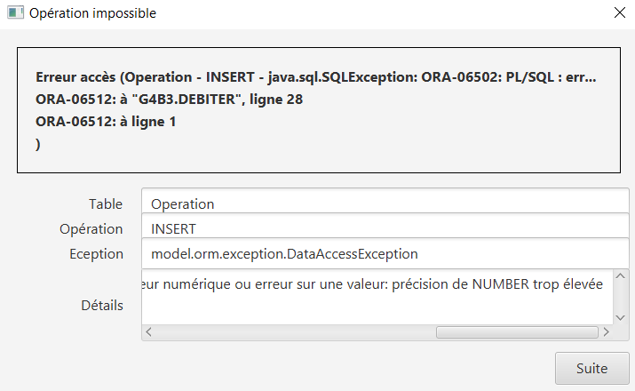

NOTE: le type d'opération peut être "espèces" ou "chèque"

image:img/credit6.png[]

*réaliser un virement compte à compte*

Cette fonctionnalité permet de réaliser un virement de compte à compte. +
En cliquant sur le bouton « enregistrer virement » une fenêtre d'enregistrement d'un  s'ouvrira

image:img/virement.png[]
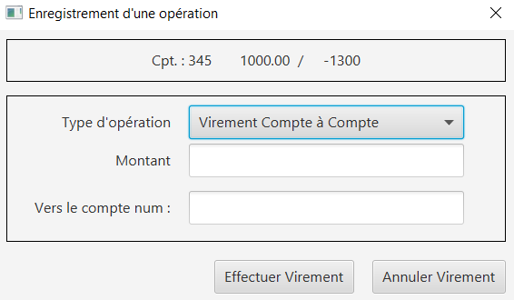

En cliquant sur le bouton « effectuer virement » cela aura pour effet de transférer le montant sélection du compte vers le compte portant l'id enregistrer et en cliquant sur le bouton « annuler virement » l'action sera annuler

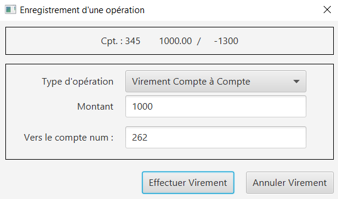
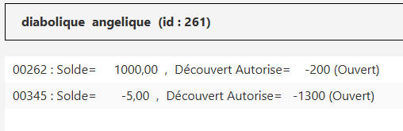

WARNING: si le découvert est dépassé, une fenêtre d'Exception s'ouvre

image:img/virement5.png[]

### utilisateur : Chef D'agence

NOTE: Ces fonctionnalités ne sont disponible que pour les comptes ayant les droits d'accès "Chef d'Agence"

#### Fenêtre principale 

*gestion des employés*

#### Fenêtre gestion des employés

*rechercher les employés*

Cette fonctionnalité permet de rechercher les employés dans l'Agence bancaire. +
En cliquant sur le bouton « rechercher » les information des employés s'afficheront dans la fenêtre

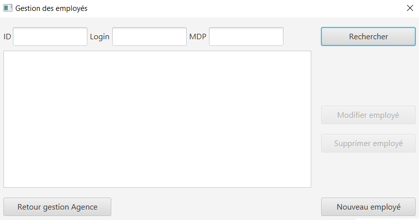
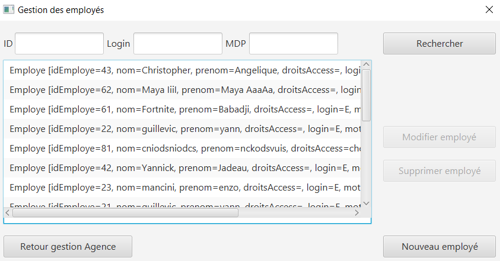

*modification d'un employé*

Cette fonctionnalité permet de modifié les informations de l'employé sélectionné. +
En cliquant sur le bouton « modifier employé » une fenêtre de modification des employés s'ouvre.

image:img/modifier-employe.png[]

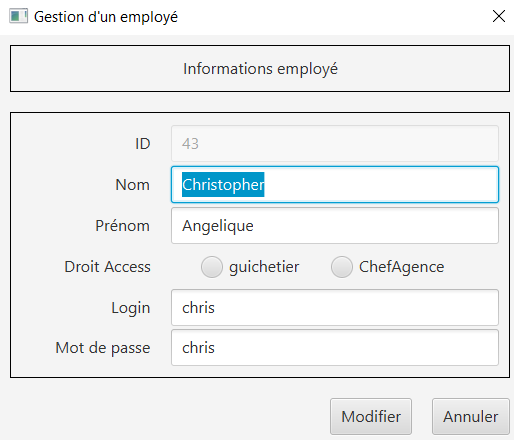

En cliquant sur le bouton « modifier » les nouvelles informations de l'employés s'enregistreront dans la Base de Données et en cliquant sur le bouton « annuler » cela annulera l'action

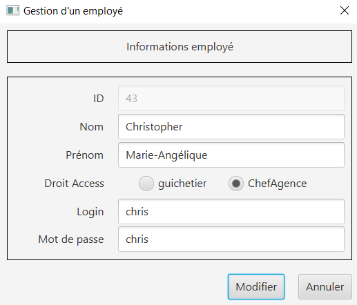
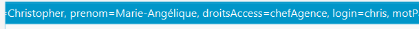

WARNING: si une information saisies n'est pas correct, une fenêtre d'alerte s'ouvrira

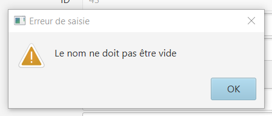

*Désactivation d'un employé*

*création d'un employé*

Cette fonctionnalité permet de créer un employé. +
En cliquant sur le bouton « nouveau employé » une fenêtre de création d'un employé s'ouvre.

image:img/creer-employe.png[]
image:img/creer-employe2.png[]

En cliquant sur le bouton « ajouter » la création de l'employé sera enregistrer dans la Base de Données et en cliquant sur le bouton « annuler », cela annulera l'action.

image:img/creer-employe3.png[]
image:img/creer-employe4.png[]

WARNING: si l'une des informations n'est pas correct, une fenêtre d'alerte s'affiche

image:img/creer-employe5.png[]

